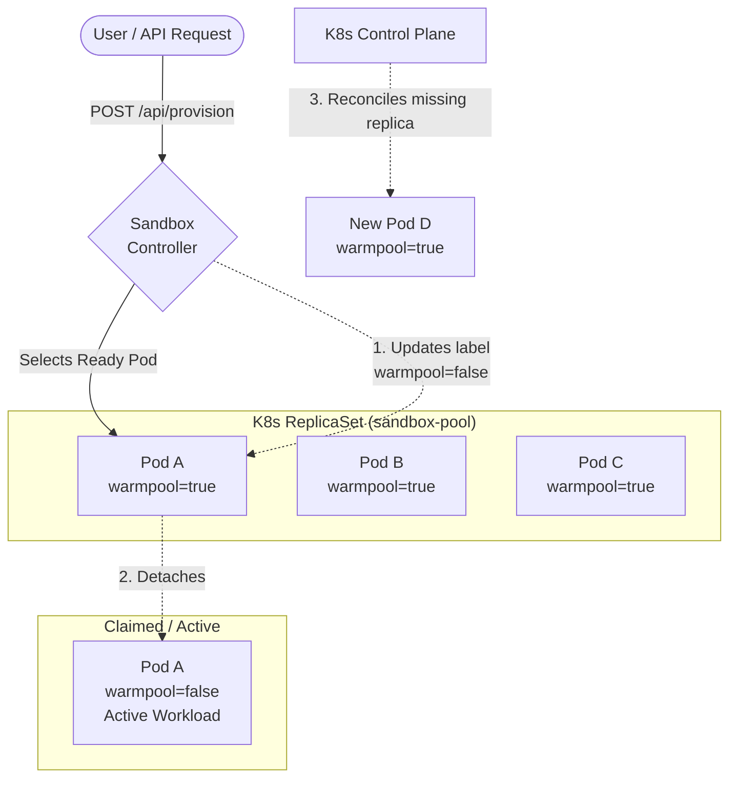
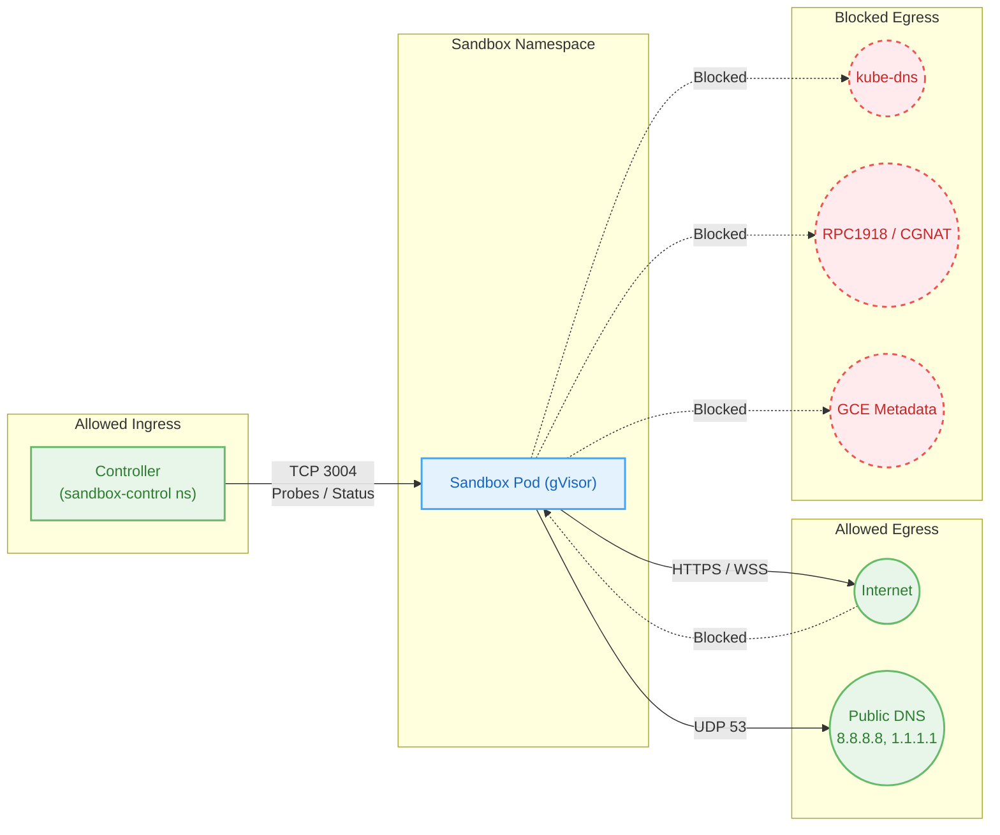

# Sandbox Application

Warm pool controller and simulation workloads for testing gVisor sandbox environments on GKE.

## Architecture

```
app/
├── controller/     # Warm pool controller (Go, runs in sandbox-control namespace)
├── sandbox/        # Simulation pod binary (Go, runs in sandbox namespace with gVisor)
├── manifests/      # K8s manifests
│   ├── namespaces.yaml          # sandbox + sandbox-control namespaces
│   ├── controller.yaml          # Controller deployment, service, RBAC
│   ├── deployment.yaml          # Sandbox warm pool deployment (gVisor, public DNS)
│   ├── sandbox-isolation.yaml   # NetworkPolicy (internet-only egress, controller ingress)
│   └── sandbox-sa.yaml          # Sandbox service account + RBAC
├── tests/
│   ├── benchmark.sh             # Load testing / QPS benchmarks
│   ├── monitor-cilium-identity.sh  # Cilium identity churn monitor
│   ├── test-detach-comparison.sh   # Dirty vs clean detach RS behavior test
│   └── test-sandbox-lifecycle.sh   # End-to-end lifecycle tests
├── deploy.sh       # Build, push, and deploy script
└── .current-tag    # Auto-generated image tag
```

### Controller

Manages a warm pool of sandbox pods via a K8s Deployment. Pods sit idle until claimed (detached from the Deployment by flipping `warmpool=false` label and clearing `ownerReferences` atomically). The clean detach bypasses the RS controller's `ReleasePod` path, preventing Expectations hangs — K8s immediately auto-replaces the pod.


<details>
<summary>View Mermaid Source</summary>



</details>

**Features:**
- Pool size management (scales Deployment replicas)
- Provision/claim sandboxes with lifetime expiry
- Expose sandboxes externally via LoadBalancer
- Pod logs, events, and exec
- Prometheus metrics (schedule duration, claim-to-ready latency)
- Embedded web UI dashboard

**API endpoints:**
| Method | Path | Description |
|--------|------|-------------|
| GET | `/api/status` | Pool status counts |
| GET | `/api/sandboxes` | List all sandboxes |
| GET | `/api/sandboxes/{name}` | Sandbox detail |
| GET | `/api/sandboxes/{name}/logs` | Pod logs |
| GET | `/api/sandboxes/{name}/events` | Pod events |
| POST | `/api/provision` | Claim an idle sandbox |
| POST | `/api/sandboxes/{name}/restart` | Restart a sandbox |
| DELETE | `/api/sandboxes/{name}` | Delete a sandbox |
| PUT | `/api/pool-size` | Set pool size |
| GET | `/api/metrics/summary` | Metrics summary |
| POST | `/api/metrics/reset` | Reset metrics |
| GET | `/metrics` | Prometheus metrics |
| WS | `/terminal/{name}` | Interactive terminal |
| GET | `/ui` | Web dashboard |

### Simulation Pod

Runs inside gVisor-sandboxed pods. Simulates realistic user workloads:

1. **Phase 1 — Download:** Fetches 5 × 1 MB from external speedtest servers
2. **Phase 2 — Disk:** Writes 500 MB–3 GB random data to ephemeral storage
3. **Phase 3 — CPU:** Duty-cycled load bursts (90% light/8% medium/2% heavy) until SIGTERM
4. **Background:** WebSocket session to Cloud Run (ping/pong every 2s), network probe to 8.8.8.8

### Network Isolation


<details>
<summary>View Mermaid Source</summary>



</details>

Sandbox pods (`sandbox-isolation.yaml`) enforce strict isolation:
- **Egress:** Internet only — all RFC1918, CGNAT, loopback, link-local, and metadata server blocked
- **Ingress:** Only `sandbox-control` namespace on port 3004 (health probes)
- **DNS:** Pods use `dnsPolicy: None` with public nameservers (8.8.8.8, 1.1.1.1) — no kube-dns access

## Usage

### Build & Deploy

```bash
# Build both images (ARM Mac → AMD64)
./deploy.sh build

# Push to Google Artifact Registry
./deploy.sh push

# Deploy to GKE (5 replicas by default)
./deploy.sh deploy 10

# Or build + push + deploy in one command
./deploy.sh all 10

# Teardown everything
./deploy.sh teardown
```

### Access the Dashboard

```bash
kubectl port-forward -n sandbox-control svc/sandbox-controller 8080:8080
# Open http://localhost:8080/ui
```

## Configuration

All configuration is read from the project `.env` file:

| Variable | Used by | Description |
|----------|---------|-------------|
| `PROJECT` | deploy.sh | GCP project ID |
| `REGION` | deploy.sh | GAR region |
| `TARGET_NAMESPACE` | controller | Sandbox pod namespace (default: sandbox) |
| `DEPLOYMENT_NAME` | controller | Deployment to manage (default: sandbox-pool) |
| `POOL_SIZE` | controller | Initial pool size (default: 5) |
