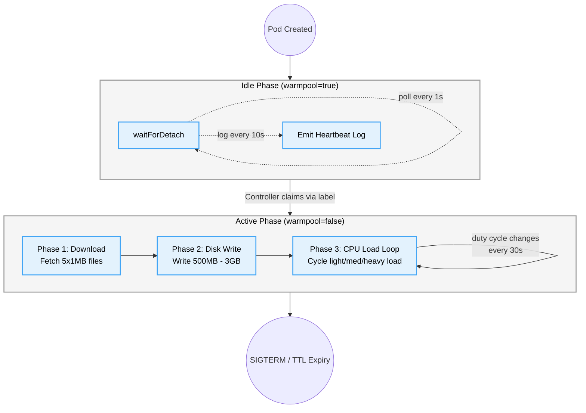

# Sandbox Simulation Integration Spec

## Overview

The sandbox simulation binary (`app/sandbox/`) runs inside each warm pool pod. It simulates developer workload patterns: network downloads, ephemeral disk writes, and CPU load cycles. It also maintains a persistent WebSocket session to a Cloud Run server and exposes health/status via an HTTP endpoint.

## Service

| Property         | Value                                         |
| ---------------- | --------------------------------------------- |
| Binary           | `/sandbox`                                    |
| Port             | `3004`                                        |
| Image base       | `debian:bookworm-slim` (with tools)           |
| Runtime          | gVisor (`runtimeClassName: gvisor`)           |
| Labels file      | `/etc/podinfo/labels` (Downward API)          |

## Lifecycle


<details>
<summary>View Mermaid Source</summary>



</details>

### Idle Phase

On startup the pod enters the `idle` phase and polls `/etc/podinfo/labels` every 1 second, waiting for `warmpool` to change from `true` to `false`. A heartbeat log is emitted every 10 seconds.

### Phase 1: Download

Downloads 5 × 1MB files from `http://speedtest.tele2.net/1MB.zip` sequentially.

| Property         | Value                                         |
| ---------------- | --------------------------------------------- |
| File count       | 5                                             |
| File size        | 1 MB each                                     |
| Total            | 5 MB (Cloud NAT cost control)                 |
| Timeout per file | 30 seconds                                    |
| Destination      | `/tmp/downloads/`                             |

### Phase 2: Disk Write

Writes contiguous 64 MB chunks of pre-filled data to `/tmp/ephemeral/`.

| Roll (random %) | Target size | Probability |
| --------------- | ----------- | ----------- |
| 0–89            | 500 MB      | 90%         |
| 90–97           | 1 GB        | 8%          |
| 98–99           | 3 GB        | 2%          |

Chunks are pre-populated with `byte(i % 256)` at init to avoid runtime `mathrand.Read` CPU overhead.

### Phase 3: Load Loop

Runs until the pod receives SIGTERM (TTL expiry or GC).

| Roll (random %) | Tier   | Max cores | Duty cycle | Probability |
| --------------- | ------ | --------- | ---------- | ----------- |
| 0–89            | light  | 1         | 30%        | 90%         |
| 90–97           | medium | 1         | 100%       | 8%          |
| 98–99           | heavy  | all CPUs  | 100%       | 2%          |

States cycle randomly every 30 seconds: idle → light → moderate → heavy → peak.

## HTTP Endpoint

### `GET /_sandbox/status` (port 3004)

```json
{
  "status": "ok",
  "ready": true,
  "pod": "sandbox-pool-abc123",
  "phase": "load",
  "cpuTier": "light",
  "dutyPct": 0.30,
  "wsConnected": true
}
```

Used by:
- **Liveness probe**: `periodSeconds: 60`
- **Readiness probe**: `periodSeconds: 2`
- **Startup probe**: `periodSeconds: 1`, `failureThreshold: 1000`
- **Controller proxy**: `GET /api/sandboxes/{name}/status`

## Background Tasks

### Network Probe (`probe.go`)

Runs a TLS connect probe to `https://8.8.8.8` every 100ms until a 200/301/302 is received. Measures time from pod readiness to first successful external connection. Writes a `custom.googleapis.com/benchmark/network_probe_latency_ms` metric to Cloud Monitoring via the Monitoring API.

### WebSocket Session (`ws.go`)

Maintains a persistent WebSocket connection to the WS server (Cloud Run).

| Property             | Value                                     |
| -------------------- | ----------------------------------------- |
| Ping interval        | 2 seconds                                 |
| Reconnect delay      | 2 seconds                                 |
| Connect timeout      | 10 seconds                                |
| Auth                 | GCE metadata ID token (Workload Identity) |
| Heartbeat logging    | First ping + every 30th ping              |

## Environment Variables

| Variable         | Source            | Description                          |
| ---------------- | ----------------- | ------------------------------------ |
| `POD_NAME`       | Downward API      | Pod name for logging                 |
| `POD_NAMESPACE`  | Downward API      | Namespace for Cloud Monitoring       |
| `WS_SERVER_URL`  | `deploy.sh`       | WebSocket server URL                 |
| `PROJECT`        | Fallback only     | GCP project (if metadata unavailable)|

## Observability

All logs are structured JSON via `logEvent()`:

| Phase      | Key messages                                          |
| ---------- | ----------------------------------------------------- |
| `startup`  | `sandbox simulation ready`                            |
| `warmpool` | `waiting for detach`, `detached from warm pool`       |
| `download` | `starting downloads`, `completed`, `all downloads complete` |
| `disk`     | `starting ephemeral storage write`, `write complete`  |
| `load`     | `starting CPU load`, `state change`                   |
| `probe`    | `pod ready to transmit`, `network probe succeeded`    |
| `ws`       | `connected`, `first pong received`, `connection lost` |
| `lifecycle`| `received SIGTERM`, `pod terminated by controller`    |

## Cloud Monitoring Metrics

| Metric Type                                          | Labels          | Description                    |
| ---------------------------------------------------- | --------------- | ------------------------------ |
| `custom.googleapis.com/benchmark/network_probe_latency_ms` | pod_name, status | Network probe latency in ms   |
